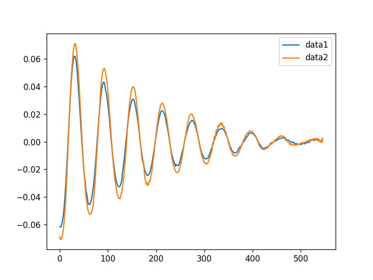
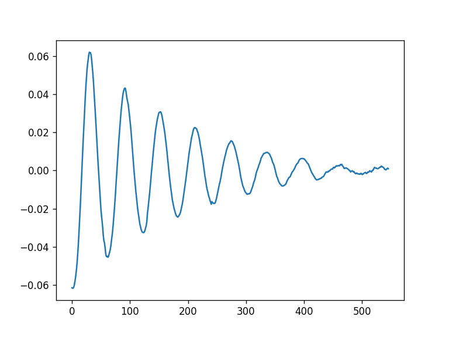
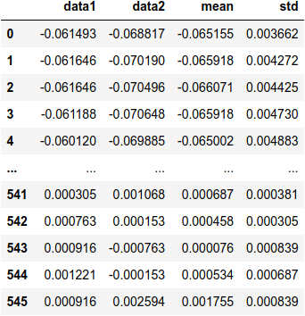
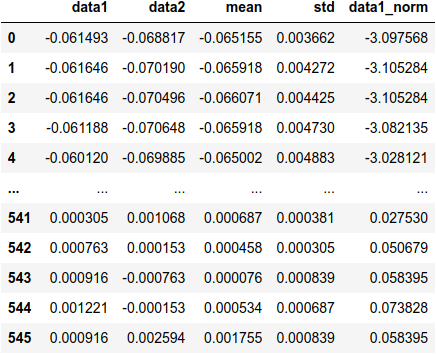
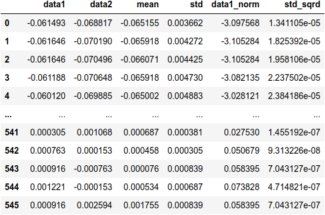
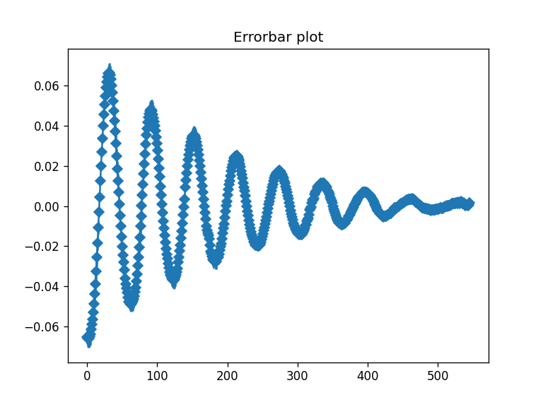
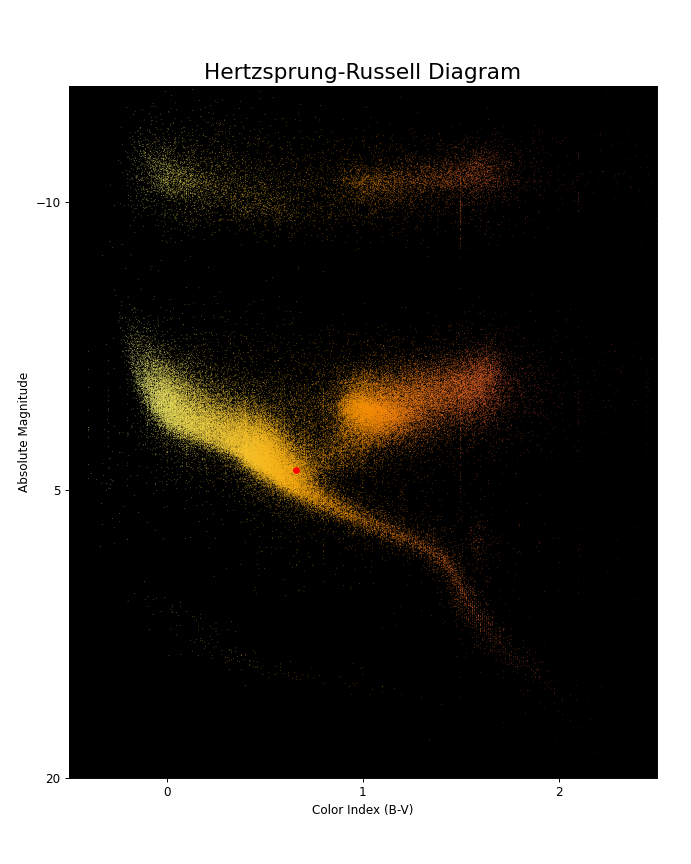

# Tutorial de Pandas

## Pandas:

Pandas é uma biblioteca de Python para análise e manipulação de dados.

Você pode instalar com pip:

```console
python -m pip install -U pandas
```

## Refazendo a última prática

### Pandas no Lab:

Com os dados da aula sobre 
[labfis](https://phisgroup.github.io/labfis.py/),
podemos refazer algumas partes em poucas linhas:

Primeiro, importamos a biblioteca:

```python
import pandas as pd
```

Vamos abrir os arquivos *data1.dat* e *data2.dat* e criar um dataframe
a partir deles. Dataframes são um tipo específico do pandas e são
basicamente tabelas.

```python
data1 = pd.read_csv("data1.dat", names=['data1'])
data2 = pd.read_csv("data2.dat", names=['data2'])
df = pd.concat([data1,data2], axis=1)
```

você verá algo como:


O comando `read_csv()` serve para abrir arquivos com dados e, apesar do
nome, não precisamos usar apenas arquivos `.csv`. Caso você queria abrir
um arquivo numa pasta diferente do seu arquivo `.py` ou notebook,
é preciso passar o caminho completo.
O argumento `names` 
serve para passarmos uma lista de nomes para as colunas do dataframe. 

Por fim, `concat()` concatena dois dataframes ao longo 
das linhas(`axis=0`)ou colunas(`axis=1`).

Agora a primeira vantagem do pandas: podemos fazer o primeiro plot com
um simples comando:

```python
df.plot()
```

que nos retorna:



Num total de 4 linhas temos um belo plot dos nossos dados!

Também podemos plotar apenas uma coluna:

```python
df['data1'].plot()
```



Também é possível passar uma lista de colunas.

Podemos criar novas colunas simplesmente atribuindo dados à uma 
coluna com um novo nome. Como exemplo vamos criar duas novas colunas,
uma com o desvio padrão e outra com a média:

```python
df['mean'] = df.mean(axis=1)
df['std'] = df.std(axis=1)
```




É possível fazer operações com as colunas:

```python
df['data1_norm'] = (df['data1'] - df['data1'].mean())/df['data1'].std()
```



ou aplicar funções(inclusive do numpy!) ao dataframe:

```python
df['std_sqrd'] = df['std'].apply(lambda x:x**2)
```



Por fim, podemos criar o gráfico com barras de erro. O método `plot()`
também recebe qualquer argumento da função plot do matplotlib, então 
é possível colocar, por exemplo, um título:

```python
df['mean'].plot(yerr=df['std'], marker ='D', title='Errorbar plot')
```




Isso é só o básico. Pandas pode ser tão complexo quanto seus dados
precisarem e a [documentação](https://pandas.pydata.org/docs/getting_started/index.html#getting-started)
é ótima.

## Exemplo Astronômico:
A partir desses 
[dados](https://github.com/astronexus/HYG-Database)
, em especial a tabela `hygdata_v3.csv`, vamos contruir o 
[Diagrama HR](https://en.wikipedia.org/wiki/Hertzsprung%E2%80%93Russell_diagram)
.

```python
data = pd.read_csv('/home/hiroshi/2022-1/curso_caifsc/hygdata_v3.csv')
df = pd.DataFrame(data)
df.columns

fig = plt.figure(
    figsize=(8, 10),
    dpi=72)

ax = fig.add_axes([.1, .1, .85, .8])

ax.set_title('Hertzsprung-Russell Diagram', fontsize=18)
ax.title.set_position([.5, 1.03])
ax.set_xlabel('Color Index (B-V)')
ax.set_ylabel('Absolute Magnitude')

ax.scatter(
    df['ci'],
    df['absmag'],
    marker='.',
    s=[1] * len(df),
    c=df['ci'],
    cmap='inferno_r',
    linewidth=0)

ax.set_facecolor('black')
ax.scatter(0.656, 4,83, marker='.', c='red')

ax.set_xlim(-.5, 2.5)
ax.set_xticks(np.linspace(0, 2, 3, endpoint=True))
ax.set_ylim(18, -16)
ax.set_yticks(np.linspace(20, -10, 3, endpoint=True))
```


